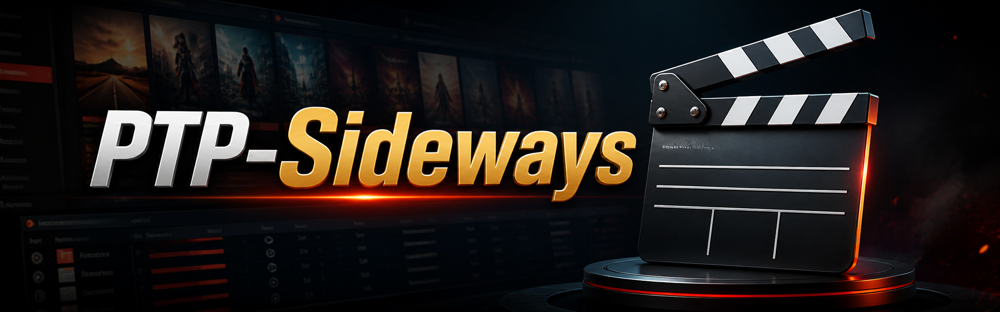

<p align="center">
  
</p>

<h1 align="center">PTP Sideways</h1>

<p align="center"><em>A widescreen dark theme paired with an all-in-one companion userscript.</em></p>

<p align="center">
  
  
  
  
  
  
</p>

---

## Overview

PTP Sideways is a paired stylesheet and userscript bundle. The CSS provides the
widescreen dark restyle; the userscript merges every companion script into a single
install, with each module gated to the pages its standalone version matched and
isolated so one failure cannot take down the rest.

| File | Role |
|---|---|
| `PassThatPopcorn.css` | Widescreen dark restyle |
| `PTP Suite.user.js` | All companion modules in one install |

## Features

- **TMDb enricher** — richer detail pages with hero art and extended metadata.
- **TMDb people** — cast and crew cards.
- **Latest digital** — recent digital release surfacing.
- **IMDb Parents Guide** via GraphQL, with colour-coded categories.
- **Radarr integration** with multi-server status and one-click add.
- **Fanart.tv ClearLogo** panel.
- **Trailer modal** with a clean embedded player.
- **Collapsible categories** on detail pages.
- **Homepage Top 10** poster strip, plus a single-row poster layout.

## Install

### 1. Stylesheet

Load `PassThatPopcorn.css` through your profile's stylesheet setting, or in a
userstyle manager such as [Stylus](https://add0n.com/stylus.html).

### 2. Userscript

Install with [Tampermonkey](https://www.tampermonkey.net/) or [Violentmonkey](https://violentmonkey.github.io/):

```text
https://gitlab.com/Prism_16/PTP-Sideways/-/raw/main/PTP%20Suite.user.js?inline=false
```

> Disable any older standalone scripts that duplicate these modules first, or you
> will get duplicate panels.

### 3. API keys

The script stores your own keys in userscript-manager storage via the manager menu.
TMDb powers the enricher and people modules; Fanart.tv powers the logo panel; Radarr
needs your server URL and key. Modules without a configured key skip themselves.

No keys are stored in this repository.

## Licence

Released under the [MIT Licence](LICENSE).
